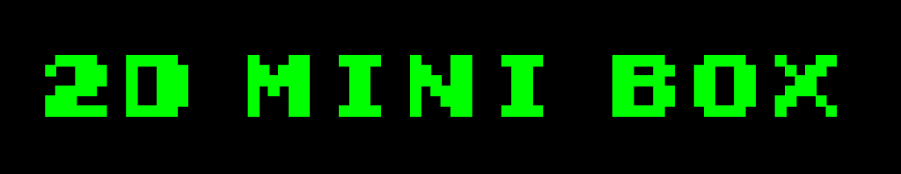

<h1 align="center">
  
</h1>

**- [Click here for English version.](README_EN.md)**
 
 

Colección de minijuegos 2D completamente programados por mí. Aquí iré recopilando los diferentes juegos que vaya haciendo, inspirados por varios clásicos (y no tan clásicos) arcades.

Solo soy el autor de la programación. Los sprites y SFX utilizados en algunos juegos no son de mi propiedad.

Este juego no es comercial, solo es un proyecto para aprender y practicar nuevas mecánicas con Unity.

## Compilación del proyecto

El proyecto se ha creado utilizando la versión 2021.3.5f1 de Unity.

Simplemente clona el repositorio o copia los archivos contenidos en él y abre el proyecto con Unity. Los recursos necesarios se instalarán automáticamente.

Una vez dentro del editor de Unity, se podrá modificar y compilar el proyecto.

## Instrucciones del juego

Para moverte a través de los menú, puedes utilizar el ratón.

Las instrucciones para cada juego se verán pulsando sobre el botón "Ayuda" en el menú inicial.
Por lo general, todos los juegos se controlan utilizando las teclas WASD.

## Descarga del juego

Actualmente, esta versión del juego puede descargarse de los siguientes sitios.

<a href="https://sergiomejias.itch.io/2d-mini-box">
<a href="https://gamejolt.com/games/2d-mini-box/736843">
<a href="https://play.google.com/store/apps/details?id=com.SergioMejias.MiniBox2D">
<a href="https://galaxy.store/2dmini">