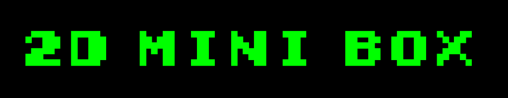

<h1 align="center">
  
</h1>

**- [Pulsa aquí para la versión en español.](README.md)**
 
 

Collection of 2D minigames completely programmed by me. Here I will be collecting different games that I am doing, inspired by various arcade classics.

I am only the author of the programming. The sprites and the SFX are not my property.

This game is non-commercial, I'm just using it to learn and practice new mechanics with Unity.

## Project build

The project is created using Unity 2021.3.5f1.

Just clone the repository or copy the files contained in it and open the project with Unity. The necessary resources will be installed automatically.

Once inside the Unity editor, the project can be modified and compiled.

## Game instructions

To navigate through the menus, you can use mouse.

The instructions for each game are visible by pressing the "Help" button within the start menu.
Usually all games are controlled using the WASD keys.

## Game download

Currently, this version of the application can be downloaded from the following sites.

<a href="https://sergiomejias.itch.io/2d-mini-box">
<a href="https://play.google.com/store/apps/details?id=com.SergioMejias.MiniBox2D">
<a href="https://galaxy.store/2dmini">
